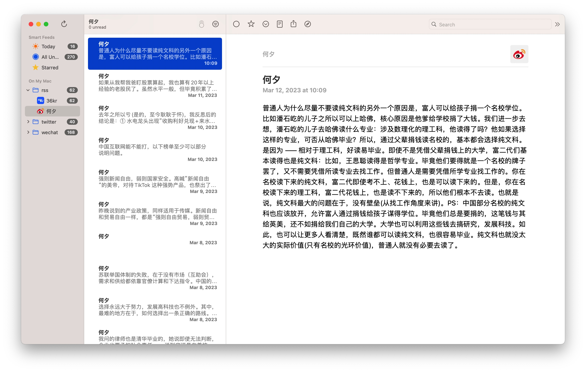
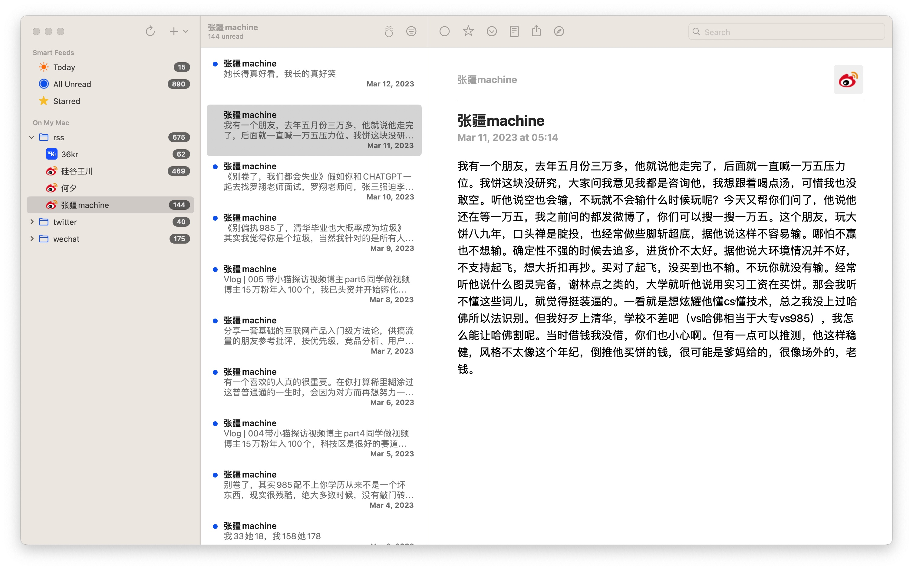

#  🦢 RSSHub

自用 RSSHub

* 迭代开发中...

### About

总有一些原创的知识博主分享一些真知灼见，而这个工具，就是把他原创的一些内容组成自定义的 RSS，选中任意一款 RSS 阅读器，就可以把他某平台的内容都统一导入到 RSS 阅读器中。

### Features

- 博主管理
- 自动解析博文
- 自动同步新原创博文

### Demo

### Author

[XieWeiXie](https://github.com/XieWeiXie)
